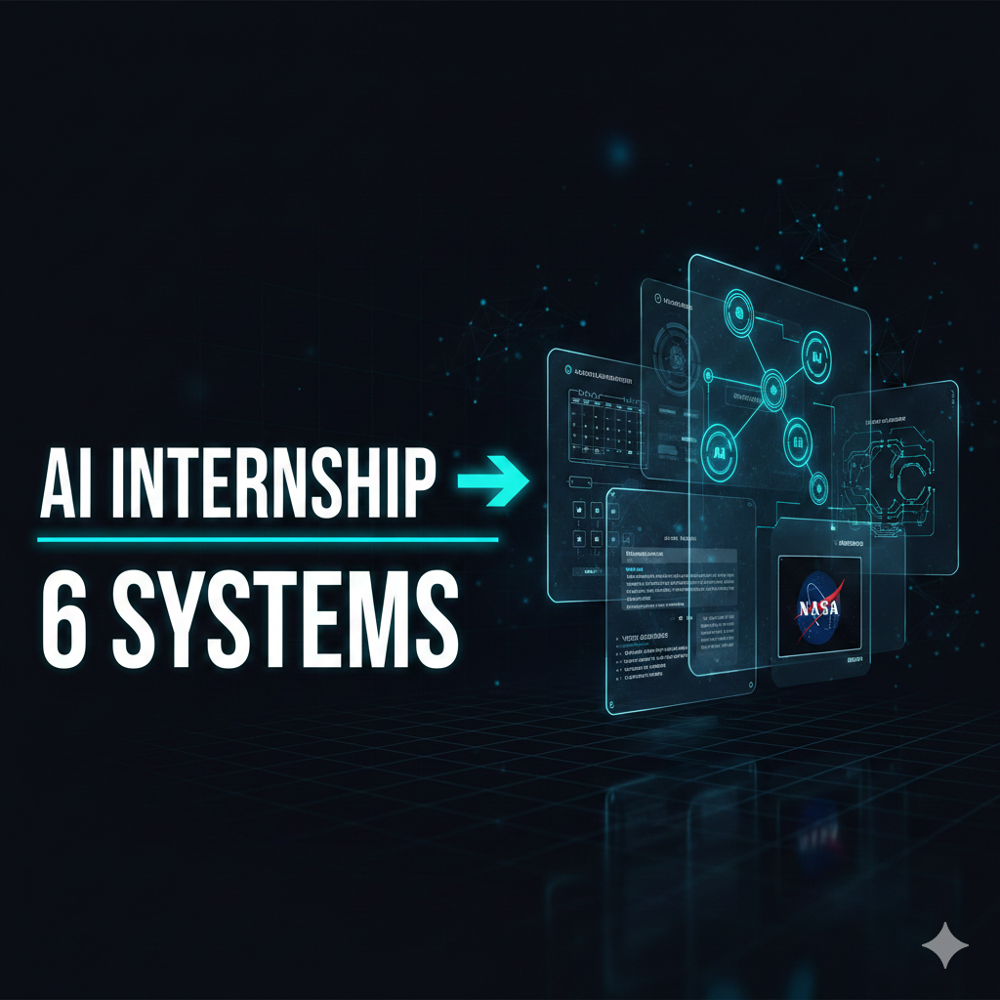
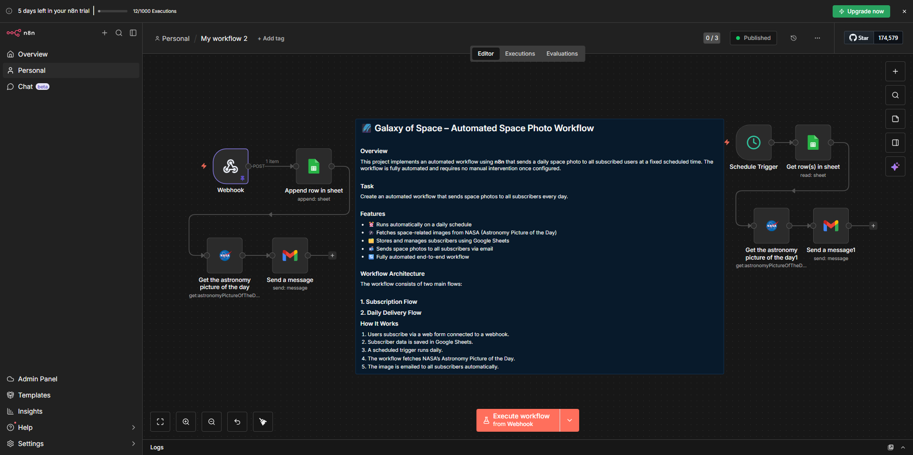
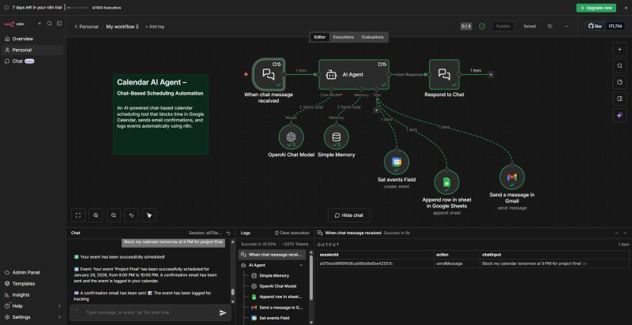
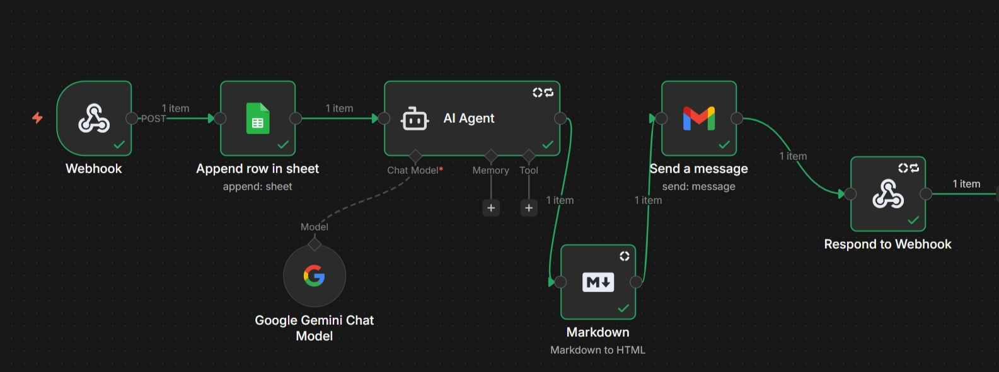
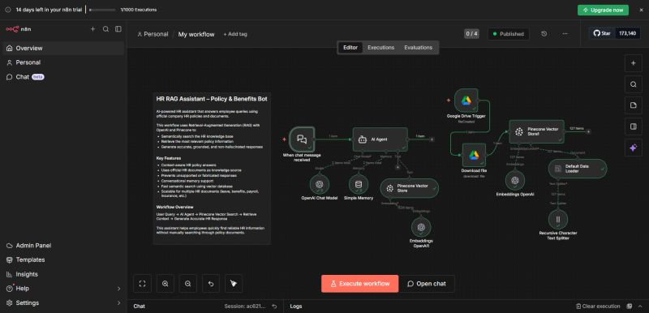
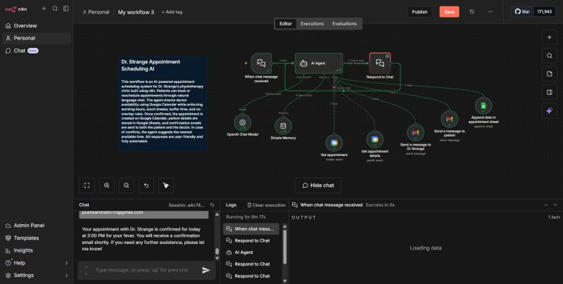
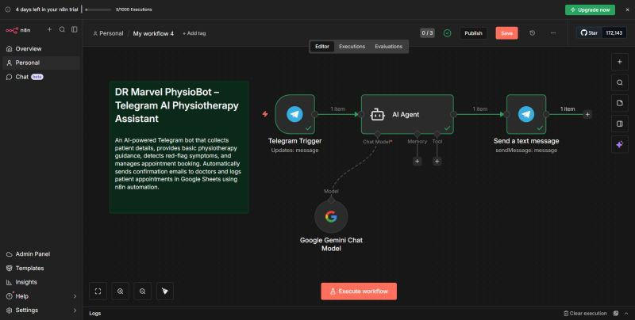

# 🤖 AI Internship → 6 Automated Systems Built with n8n

<div align="center">


<!-- Placeholder: Replace with Image 9 - AI Internship 6 Systems cover photo -->

[](https://n8n.io)
[](https://deepmind.google/technologies/gemini/)
[](https://openai.com)
[](https://youtu.be/MC8TpVstNrQ?si=lh_J6FgqFJZQ2mVD)

> **6 production-ready AI automation workflows** built during an AI internship using n8n, covering space photo delivery, calendar scheduling, HR knowledge bots, physiotherapy assistants, and more.

</div>

---

## 📋 Table of Contents

- [Overview](#-overview)
- [Workflow 1 – Galaxy of Space: Automated Space Photo Workflow](#-workflow-1--galaxy-of-space-automated-space-photo-workflow)
- [Workflow 2 – Calendar AI Agent](#-workflow-2--calendar-ai-agent)
- [Workflow 3 – AI Lead Capture & Email Responder (Webhook + Gemini)](#-workflow-3--ai-lead-capture--email-responder-webhook--gemini)
- [Workflow 4 – HR RAG Assistant: Policy & Benefits Bot](#-workflow-4--hr-rag-assistant-policy--benefits-bot)
- [Workflow 5 – Dr. Strange Appointment Scheduling AI](#-workflow-5--dr-strange-appointment-scheduling-ai)
- [Workflow 6 – DR Marvel PhysioBot: Telegram AI Physiotherapy Assistant](#-workflow-6--dr-marvel-physiobot-telegram-ai-physiotherapy-assistant)
- [Analytics & Stats](#-analytics--stats)
- [Prerequisites](#-prerequisites)
- [Getting Started](#-getting-started)
- [Explanation Video](#-explanation-video)

---

## 🌐 Overview

This repository documents **6 end-to-end AI automation systems** built using n8n as the backbone orchestration engine. Each workflow integrates real-world tools like Gmail, Google Sheets, Google Calendar, NASA APIs, Telegram, and vector databases to create fully automated, intelligent pipelines.

```
📦 6 Workflows
 ┣ 🌌 Galaxy of Space         → NASA API + Gmail + Webhook
 ┣ 📅 Calendar AI Agent       → OpenAI + Google Calendar + Sheets
 ┣ 📬 Lead Capture Responder  → Gemini + Gmail + Webhook
 ┣ 📚 HR RAG Assistant        → OpenAI + Pinecone + Google Drive
 ┣ 🏥 Appointment Scheduler   → OpenAI + Google Calendar + Gmail
 ┗ 💪 Telegram PhysioBot      → Gemini + Telegram
```

---

## 🌌 Workflow 1 – Galaxy of Space: Automated Space Photo Workflow

<div align="center">


<!-- Placeholder: Replace with Image 1/5 - Galaxy of Space n8n editor screenshot -->

</div>

### 📖 Description

An automated newsletter system that **fetches NASA's Astronomy Picture of the Day** and emails it to all subscribed users daily — zero manual intervention required.

### 🔄 Workflow Architecture

```
SUBSCRIPTION FLOW:
Webhook (POST) ──► Append row in Google Sheet

DAILY DELIVERY FLOW:
Schedule Trigger ──► Get row(s) in Sheet ──► Get Astronomy Picture of the Day ──► Send a message (Gmail)
```

<div align="center">

| Node | Purpose |
|------|---------|
| 🔗 Webhook | Receives subscriber sign-ups via POST |
| 📊 Append row in Sheet | Saves subscriber email to Google Sheets |
| ⏰ Schedule Trigger | Fires daily at a fixed time |
| 📊 Get row(s) in Sheet | Retrieves all subscriber emails |
| 🚀 NASA APOD Node | Fetches astronomy picture & description |
| 📧 Send a message (Gmail) | Emails photo to each subscriber |

</div>

### 🛠️ How to Build This

**Step 1 – Subscription Flow**
1. Add a **Webhook** node → set method to `POST`
2. Connect to **Google Sheets → Append Row** node
3. Map incoming fields (email, name) to sheet columns
4. Test by sending a POST request with subscriber data

**Step 2 – Daily Delivery Flow**
1. Add a **Schedule Trigger** → set to daily (e.g., 9:00 AM)
2. Connect to **Google Sheets → Get Rows** to fetch all subscribers
3. Add **HTTP Request** node → URL: `https://api.nasa.gov/planetary/apod?api_key=YOUR_KEY`
4. Connect to **Gmail → Send Message** node
5. Use expressions to loop over each subscriber row

**Step 3 – Email Template**
```
Subject: 🌌 Today's Astronomy Picture of the Day!
Body:  {{ $json.explanation }}
```

### ⚙️ Environment Variables
```env
NASA_API_KEY=your_nasa_api_key_here
GOOGLE_SHEETS_ID=your_spreadsheet_id
GMAIL_SENDER=your@gmail.com
```

---

## 📅 Workflow 2 – Calendar AI Agent

<div align="center">


<!-- Placeholder: Replace with Image 2 - Calendar AI Agent screenshot -->

</div>

### 📖 Description

A **chat-based AI scheduling assistant** that understands natural language commands to book, reschedule, or cancel events in Google Calendar — while sending confirmation emails and logging everything to Google Sheets.

### 🔄 Workflow Architecture

```
When chat message received
    │
    ▼
AI Agent (OpenAI Chat Model + Simple Memory)
    ├──► Set events Field ──► Append row in Google Sheets
    ├──► Send a message in Gmail
    └──► Respond to Chat
```

<div align="center">

| Node | Purpose |
|------|---------|
| 💬 Chat Trigger | Receives user scheduling requests |
| 🤖 AI Agent | Interprets intent using OpenAI |
| 🧠 Simple Memory | Maintains conversation context |
| 📅 Set events Field | Creates/updates Google Calendar event |
| 📊 Append Row in Sheet | Logs events for tracking |
| 📧 Send Gmail | Sends booking confirmation |
| 💬 Respond to Chat | Returns confirmation to user |

</div>

### 🛠️ How to Build This

1. **Trigger**: Add **Chat Trigger** node (n8n built-in)
2. **AI Agent**: Add AI Agent node → connect to:
   - **Chat Model**: OpenAI GPT-4
   - **Memory**: Simple Memory (window buffer)
3. **System Prompt**: Define agent behavior:
   ```
   You are a calendar assistant. When a user asks to book a meeting,
   extract: date, time, duration, attendees, and purpose.
   Enforce working hours (9AM–5PM) and no overlapping events.
   ```
4. **Tools**: Connect calendar tools (Create Event, Get Events)
5. **Post-action**: Route outputs to Gmail + Sheets logging
6. **Test**: Try "Book my calendar tomorrow at 9 PM for project final"

### 📊 Sample Chat Interaction

```
User:  Book my calendar tomorrow at 9 PM for project final
Agent: ✅ Your event has been successfully scheduled!
       📅 Event: 'Project Final' scheduled for Jan 28, 2026
       ⏰ Time: 8:00 PM to 10:00 PM
       📧 A confirmation email has been sent.
       📝 The event has been logged for tracking.
```

---

## 📬 Workflow 3 – AI Lead Capture & Email Responder (Webhook + Gemini)

<div align="center">


<!-- Placeholder: Replace with Image 3 - Webhook + Gemini + Gmail workflow screenshot -->


</div>

### 📖 Description

Captures leads from a **web form or webhook**, stores them in Google Sheets, passes the data through a **Google Gemini AI Agent** to generate a personalized response, converts it to HTML, and emails it instantly — then responds back to the webhook caller.

### 🔄 Workflow Architecture

```
[Webhook / Form Submission]
    │
    ▼
Append row in Google Sheet
    │
    ▼
AI Agent (Google Gemini Chat Model)
    │
    ▼
Markdown → HTML conversion
    │
    ▼
Send a message (Gmail)
    │
    ▼
Respond to Webhook
```

<div align="center">

| Node | Purpose |
|------|---------|
| 🔗 Webhook / Form | Entry point for lead data |
| 📊 Append Row | Saves lead to Google Sheets CRM |
| 🤖 AI Agent (Gemini) | Generates personalized email content |
| 📝 Markdown Node | Converts AI output to HTML |
| 📧 Gmail | Sends HTML email to lead |
| ↩️ Respond to Webhook | Returns HTTP response to caller |

</div>

### 🛠️ How to Build This

1. Add **Webhook** node (POST method) OR **n8n Form Trigger**
2. Connect to **Google Sheets → Append Row** (save lead data)
3. Add **AI Agent** node:
   - Model: **Google Gemini Chat Model** (gemini-pro)
   - System prompt: "Generate a warm, professional welcome email for this lead: {{ $json }}"
4. Add **Markdown** node → set to "Markdown to HTML" mode
5. Connect to **Gmail → Send Message** (use HTML body)
6. Add **Respond to Webhook** with `{ success: true }`

**Gemini API Setup:**
- Go to [Google AI Studio](https://aistudio.google.com)
- Generate API key → add as n8n credential

---

## 📚 Workflow 4 – HR RAG Assistant: Policy & Benefits Bot

<div align="center">


<!-- Placeholder: Replace with Image 4 - HR RAG Assistant n8n editor screenshot -->

</div>

### 📖 Description

An **AI-powered HR assistant** that answers employee queries using Retrieval-Augmented Generation (RAG). It searches official policy documents stored in Google Drive, retrieves the most relevant content via Pinecone vector database, and returns accurate, grounded answers via chat.

### 🔄 Workflow Architecture

```
INGESTION PIPELINE:
Google Drive Trigger ──► Download File ──► Recursive Character Text Splitter
    ──► Embeddings (OpenAI) ──► Pinecone Vector Store (upsert)

QUERY PIPELINE:
Chat Trigger ──► AI Agent (OpenAI + Simple Memory)
    ──► Pinecone Vector Store (search) ──► Generate Accurate Response
```

<div align="center">

| Node | Purpose |
|------|---------|
| 📁 Google Drive Trigger | Watches for new/updated policy docs |
| 📥 Download File | Fetches document content |
| ✂️ Text Splitter | Chunks documents into segments |
| 🧮 Embeddings OpenAI | Vectorizes text chunks |
| 🗃️ Pinecone Vector Store | Stores & retrieves vector embeddings |
| 🤖 AI Agent | Orchestrates RAG query + answer |
| 🧠 Simple Memory | Chat history context |

</div>

### 🛠️ How to Build This

**Phase 1 – Document Ingestion**
1. Add **Google Drive Trigger** → watch folder for new files
2. **Download File** → get file content as binary
3. Add **Default Data Loader** → parse PDF/DOCX
4. Add **Recursive Character Text Splitter** → chunk size: 1000, overlap: 200
5. Add **Embeddings OpenAI** (text-embedding-3-small)
6. Add **Pinecone Vector Store** → mode: Insert

**Phase 2 – Chat Query**
1. Add **Chat Trigger** node
2. Add **AI Agent** → System prompt:
   ```
   You are an HR assistant. ONLY answer using the retrieved documents.
   If information is not in the documents, say "I don't have that information."
   Always cite the source document.
   ```
3. Add **Pinecone Vector Store** as Tool → mode: Retrieve
4. Connect **Simple Memory** for conversation history

**Pinecone Setup:**
```
Index Name: hr-policies
Dimensions: 1536 (OpenAI ada-002)
Metric: cosine
```

### 🔑 Key Features
- ✅ Content-aware HR policy answers
- ✅ Uses official HR documents as knowledge source
- ✅ Prevents unsupported or fabricated responses
- ✅ Fast semantic search using vector database
- ✅ Scalable for multiple HR document types

---

## 🏥 Workflow 5 – Dr. Strange Appointment Scheduling AI

<div align="center">


<!-- Placeholder: Replace with Image 6 - Dr. Strange Appointment Scheduling AI screenshot -->

</div>

### 📖 Description

An **AI-powered physiotherapy appointment booking system** for a clinic. Patients interact via chat in natural language. The agent checks doctor availability in Google Calendar, enforces working hours and buffer rules, creates appointments, and notifies both the patient and doctor via Gmail — all logged in Google Sheets.

### 🔄 Workflow Architecture

```
When chat message received
    │
    ▼
AI Agent (OpenAI + Simple Memory)
    ├── Respond to Chat (multi-turn conversation)
    ├── Get appointment details ──► Google Calendar
    ├── Set appointment ──► Google Calendar (create event)
    ├── Send a message to patient ──► Gmail
    ├── Send a message to Dr. Strange ──► Gmail
    └── Append data in appointment sheet ──► Google Sheets
```

<div align="center">

| Node | Purpose |
|------|---------|
| 💬 Chat Trigger | Patient initiates booking conversation |
| 🤖 AI Agent (OpenAI) | Manages multi-turn scheduling logic |
| 🧠 Simple Memory | Maintains session context |
| 📅 Get appointment details | Checks calendar availability |
| 📅 Set appointment | Creates confirmed calendar event |
| 📧 Send message to patient | Booking confirmation email |
| 📧 Send message to doctor | Doctor notification email |
| 📊 Append to sheet | Logs appointment record |
| 💬 Respond to Chat | Returns booking status to patient |

</div>

### 🛠️ How to Build This

1. **Chat Trigger** → entry point for patient messages
2. **AI Agent** with OpenAI GPT-4 model
3. **System Prompt**:
   ```
   You are a scheduling assistant for Dr. Strange's physiotherapy clinic.
   Collect: patient name, email, condition, preferred date/time.
   Check availability, enforce 9AM-5PM hours, 30-min buffer between appointments.
   Confirm booking and notify both parties.
   ```
4. **Tools**:
   - Get Calendar Events (check availability)
   - Create Calendar Event (book slot)
   - Send Gmail (to patient + doctor)
   - Append Google Sheets (log record)
5. **Simple Memory** → window: last 10 messages

### 📊 Sample Interaction
```
Patient: I need an appointment for fever, today afternoon
Bot:     Your appointment with Dr. Strange is confirmed for today
         at 3:00 PM for your fever.
         You will receive a confirmation email shortly.
```

---

## 💪 Workflow 6 – DR Marvel PhysioBot: Telegram AI Physiotherapy Assistant

<div align="center">


<!-- Placeholder: Replace with Image 8 - DR Marvel PhysioBot Telegram workflow screenshot -->

</div>

### 📖 Description

A **Telegram-based AI bot** that acts as a physiotherapy assistant. It collects patient details via chat, provides basic physiotherapy guidance, flags red-flag symptoms requiring urgent care, manages appointment booking, and automatically sends confirmation emails while logging everything in Google Sheets.

### 🔄 Workflow Architecture

```
Telegram Trigger (new message)
    │
    ▼
AI Agent (Google Gemini Chat Model)
    │
    ▼
Send text message (Telegram)
```

<div align="center">

| Node | Purpose |
|------|---------|
| 📱 Telegram Trigger | Listens for incoming Telegram messages |
| 🤖 AI Agent (Gemini) | Processes queries + generates guidance |
| 📱 Send text message | Replies via Telegram |

</div>

### 🛠️ How to Build This

**Step 1 – Telegram Bot Setup**
1. Open Telegram → search `@BotFather`
2. Send `/newbot` → follow setup → copy the **Bot Token**
3. In n8n: Add **Telegram Trigger** → paste bot token credential
4. Set trigger on: `message`

**Step 2 – AI Agent**
1. Add **AI Agent** node
2. Model: **Google Gemini Chat Model** (gemini-pro)
3. System Prompt:
   ```
   You are DR Marvel, an AI physiotherapy assistant.
   - Collect: name, age, symptoms, pain location, duration
   - Provide basic physiotherapy advice for common conditions
   - Detect red-flag symptoms (numbness, chest pain, loss of bowel control)
     and immediately advise urgent medical care
   - Help book appointments and confirm via email
   - Always remind patients you are an AI, not a licensed doctor
   ```

**Step 3 – Response**
1. Connect to **Telegram → Send Message**
2. Map the AI agent's output text to the message body
3. Set `chat_id` from the trigger's `{{ $json.message.chat.id }}`

**Step 4 – Deploy & Test**
```bash
# Test your bot
curl -X POST https://api.telegram.org/bot<TOKEN>/sendMessage \
  -d chat_id=<YOUR_CHAT_ID> \
  -d text="Hello from DR Marvel!"
```

### 🔑 Key Features
- ✅ Real-time Telegram responses
- ✅ Red-flag symptom detection
- ✅ Appointment booking via conversation
- ✅ Auto email confirmation to doctor + patient
- ✅ Google Sheets logging

---

## 📊 Analytics & Stats

<div align="center">

### Workflow Complexity Overview

```
Workflow                     │ Nodes │ Integrations │ AI Model    │ Complexity
─────────────────────────────┼───────┼──────────────┼─────────────┼───────────
1. Galaxy of Space           │   6   │ NASA, Gmail  │ None        │ ⭐⭐
2. Calendar AI Agent         │   7   │ Calendar,    │ OpenAI GPT  │ ⭐⭐⭐⭐
                             │       │ Gmail, Sheets│             │
3. Lead Capture (Gemini)     │   6   │ Gmail,Sheets │ Gemini Pro  │ ⭐⭐⭐
4. HR RAG Assistant          │   9   │ Drive,Pinec. │ OpenAI      │ ⭐⭐⭐⭐⭐
5. Appointment Scheduler     │   9   │ Calendar,    │ OpenAI GPT  │ ⭐⭐⭐⭐⭐
                             │       │ Gmail, Sheets│             │
6. Telegram PhysioBot        │   3   │ Telegram     │ Gemini Pro  │ ⭐⭐⭐
```

### Automation Coverage

| Category | Workflows Covered |
|----------|------------------|
| 📧 Email Automation | 1, 3, 4, 5 |
| 📅 Calendar Management | 2, 5 |
| 🗃️ Data Logging (Sheets) | 1, 2, 3, 4, 5 |
| 🤖 AI Agents | 2, 3, 4, 5, 6 |
| 💬 Chat Interfaces | 2, 4, 5, 6 |
| 🌐 Webhooks/APIs | 1, 3 |
| 🧠 RAG / Vector DB | 4 |
| 📱 Telegram | 6 |

</div>

---

## 🔧 Prerequisites

Before setting up any workflow, ensure you have:

```
✅ n8n installed (cloud or self-hosted)
✅ Google Cloud Console project with APIs enabled:
   - Gmail API
   - Google Sheets API
   - Google Calendar API
   - Google Drive API
✅ OpenAI API Key (Workflows 2, 4, 5)
✅ Google Gemini API Key (Workflows 3, 6)
✅ NASA API Key - free at api.nasa.gov (Workflow 1)
✅ Pinecone account + API key (Workflow 4)
✅ Telegram Bot Token from @BotFather (Workflow 6)
```

---

## 🚀 Getting Started

### 1. Clone / Import Workflows

```bash
# Import workflow JSON files into your n8n instance
# Go to: n8n Dashboard → Workflows → Import from File
```

### 2. Set Up Credentials in n8n

```
n8n Settings → Credentials → Add New:

├── Google OAuth2 (covers Sheets, Calendar, Drive, Gmail)
├── OpenAI API
├── Google Gemini (PaLM) API
├── Telegram API
├── Pinecone API
└── NASA API (HTTP Header Auth)
```

### 3. Configure Environment

```env
# .env for self-hosted n8n
N8N_BASIC_AUTH_USER=admin
N8N_BASIC_AUTH_PASSWORD=your_password
WEBHOOK_URL=https://your-domain.com/
```

### 4. Activate Workflows

1. Open each workflow in n8n editor
2. Configure credentials for each node
3. Update Google Sheets IDs / Gmail addresses
4. Toggle **Active** switch to enable
5. Test with sample data

---

## 🎬 Explanation Video

<div align="center">

[](https://youtu.be/MC8TpVstNrQ?si=lh_J6FgqFJZQ2mVD)

**▶️ [Watch Full Walkthrough on YouTube](https://youtu.be/MC8TpVstNrQ?si=lh_J6FgqFJZQ2mVD)**

*Complete step-by-step explanation of all 6 workflows*

</div>

---

## 📁 Image Placeholders Reference

> Replace the following placeholder paths with your actual screenshot images:

| Placeholder Path | Description | Source Image |
|------------------|-------------|--------------|
| `cover.png` | Cover photo – AI Internship 6 Systems | Image 9 |
| `workflow1_overview.png` | Galaxy of Space full workflow view | Image 1 or 5 |
| `workflow2_calendar_agent.png` | Calendar AI Agent editor + chat demo | Image 2 |
| `workflow3_lead_capture.png` | Webhook + Gemini + Gmail flow | Image 3 |
| `workflow3_form_variant.png` | Form submission variant | Image 7 |
| `workflow4_hr_rag.png` | HR RAG Assistant full pipeline | Image 4 |
| `workflow5_appointment_ai.png` | Dr. Strange Appointment Scheduler | Image 6 |
| `workflow6_physiobot.png` | DR Marvel PhysioBot Telegram | Image 8 |

---


<div align="center">

**Built with ❤️ during AI Internship | Powered by n8n + Google AI + OpenAI**

⭐ Star this repo if it helped you build something awesome!

</div>
